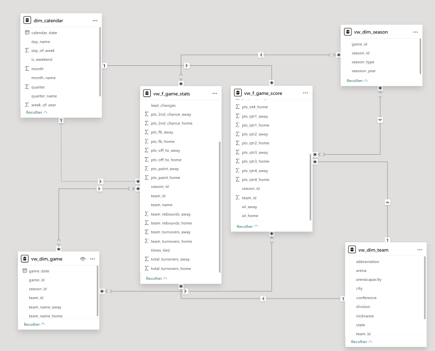
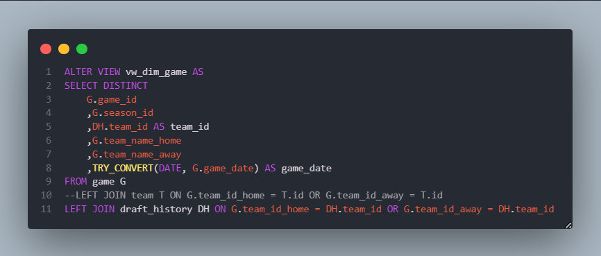
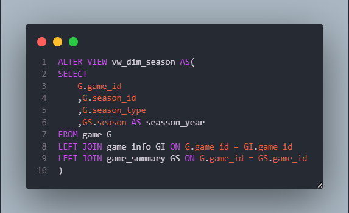
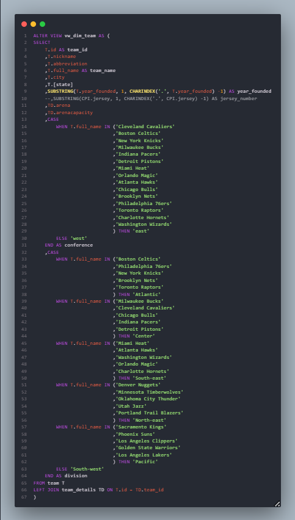
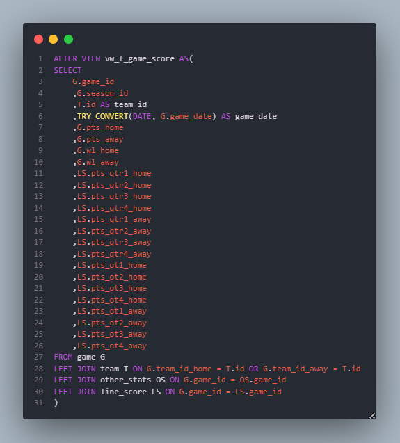
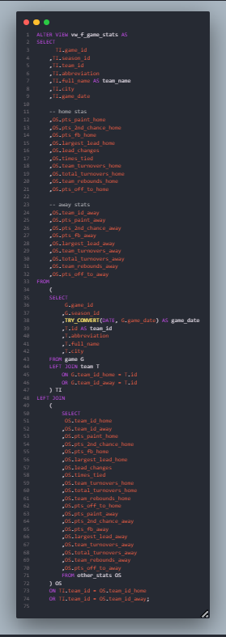

# **Modelagem**

O modelo apresentado segue a estrutura de um Modelo Estrela (Star Schema), utilizado para modelagem de Data Warehouses.

# Views

As views iniciais que estarão sendo alteradas ao longo do projeto

*vw_dim_game*

--
*vw_dim_season*

--
*vw_dim_team*

--
*vw_f_game_score*

--
*vw_f_game_stats*

